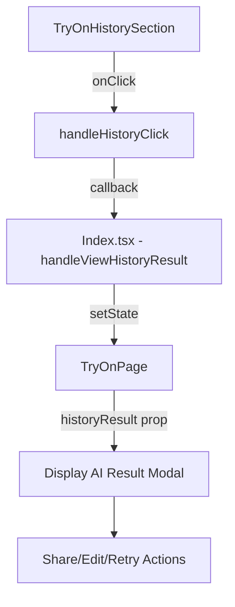

# Design Document: History Click to Try-On

## Overview

Tính năng này cho phép người dùng bấm vào hình ảnh trong phần "Lịch sử thử đồ" trên trang chủ để xem lại kết quả thử đồ đó. Khi bấm vào, hệ thống sẽ chuyển đến trang thử đồ và hiển thị ngay ảnh kết quả trong modal, cùng với các tùy chọn chia sẻ, chỉnh sửa và thử lại.

## Architecture



## Components and Interfaces

### 1. TryOnHistorySection (Modified)

Thêm prop `onViewResult` để xử lý khi người dùng bấm vào hình ảnh lịch sử.

```typescript
interface TryOnHistoryItem {
  id: string;
  result_image_url: string;
  body_image_url: string;
  created_at: string;
  clothing_items: Array<{ name: string; imageUrl: string }>;
}

interface TryOnHistorySectionProps {
  onNavigateToTryOn: () => void;
  onNavigateToHistory?: () => void;
  onViewResult?: (item: TryOnHistoryItem) => void; // NEW
}
```

### 2. TryOnPage (Modified)

Thêm prop `historyResult` để nhận kết quả từ lịch sử và hiển thị ngay.

```typescript
interface TryOnPageProps {
  initialItem?: ClothingItem;
  reuseBodyImage?: string;
  reuseClothingItems?: ClothingItem[];
  historyResult?: {  // NEW
    resultImageUrl: string;
    bodyImageUrl: string;
    clothingItems: Array<{ name: string; imageUrl: string }>;
  };
}
```

### 3. Index.tsx (Modified)

Thêm state và handler để quản lý việc xem kết quả lịch sử.

```typescript
const [historyResult, setHistoryResult] = useState<{
  resultImageUrl: string;
  bodyImageUrl: string;
  clothingItems: Array<{ name: string; imageUrl: string }>;
} | undefined>();

const handleViewHistoryResult = (item: TryOnHistoryItem) => {
  setHistoryResult({
    resultImageUrl: item.result_image_url,
    bodyImageUrl: item.body_image_url,
    clothingItems: item.clothing_items,
  });
  setActiveTab('tryOn');
};
```

## Data Models

### TryOnHistoryItem (Extended)

```typescript
interface TryOnHistoryItem {
  id: string;
  result_image_url: string;
  body_image_url: string;  // Cần fetch thêm field này
  created_at: string;
  clothing_items: Array<{ 
    name: string; 
    imageUrl: string;
  }>;
}
```

## Correctness Properties

*A property is a characteristic or behavior that should hold true across all valid executions of a system-essentially, a formal statement about what the system should do. Properties serve as the bridge between human-readable specifications and machine-verifiable correctness guarantees.*

### Property 1: History click passes correct data
*For any* history item clicked, the callback function SHALL receive the complete history item data including result_image_url, body_image_url, and clothing_items.
**Validates: Requirements 1.1**

### Property 2: History result displays immediately
*For any* valid history result passed to TryOnPage, the AI result modal SHALL be displayed immediately with the result image, and the clothing items SHALL be loaded from the history record.
**Validates: Requirements 1.2, 1.3**

### Property 3: Retry uses same inputs
*For any* retry action on a history result, the system SHALL use the same body_image_url and clothing_items from the original history record.
**Validates: Requirements 2.2**

## Error Handling

1. **Missing body_image_url**: Nếu history record không có body_image_url, hiển thị thông báo lỗi và không cho phép retry
2. **Missing clothing_items**: Nếu không có clothing items, vẫn hiển thị result nhưng disable nút retry
3. **Invalid image URL**: Hiển thị placeholder image nếu URL không hợp lệ

## Testing Strategy

### Unit Tests
- Test TryOnHistorySection click handler calls onViewResult with correct data
- Test TryOnPage displays result modal when historyResult prop is provided
- Test Index.tsx handleViewHistoryResult sets correct state

### Property-Based Tests
- Use fast-check library for property-based testing
- Test Property 1: Generate random history items, verify callback receives complete data
- Test Property 2: Generate random history results, verify modal state and clothing items
- Test Property 3: Generate random retry scenarios, verify same inputs are used

### Integration Tests
- Test full flow from clicking history item to displaying result modal
